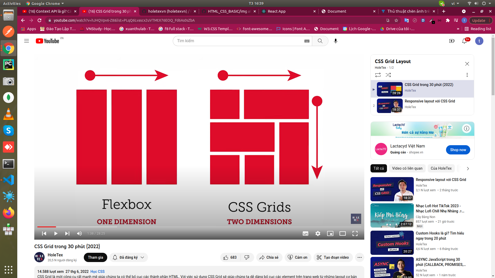
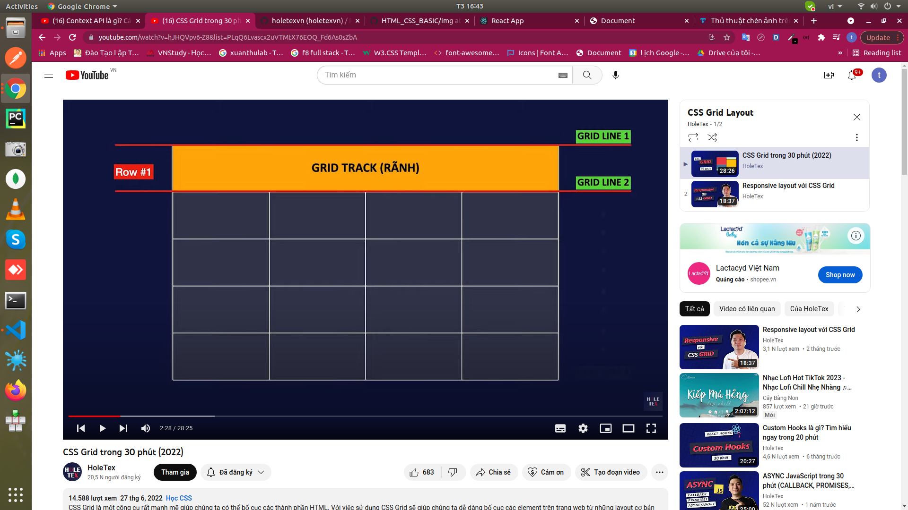

## Grids css 
- grids css khác flexbox : flexbox chỉ tạo mô hình theo 1 chiều 
- flexbox phải định nghĩa flex- direction row hoặc column
+ Grids tạo được mô hình theo 2 chiều 
- 

### các thành phần của css grids:
- grid container : <display: grid> cho bất cứ thành phần nào thì element sẽ thành grid container , có con là grid item 
- grid track : rãnh , hai bên có grid line
- 
- các grids track này khi giao nhau sẽ tạo ra grid cell 
+ grids area : đơn giản là 1 hình chữ nhật, hcn ni đơn giản chiếm bao nhiêu cột bao  nhiêu hàng

## note khac:
- 100vh : chiếm hết khoảng không gian theo chiều dọc của màng hình